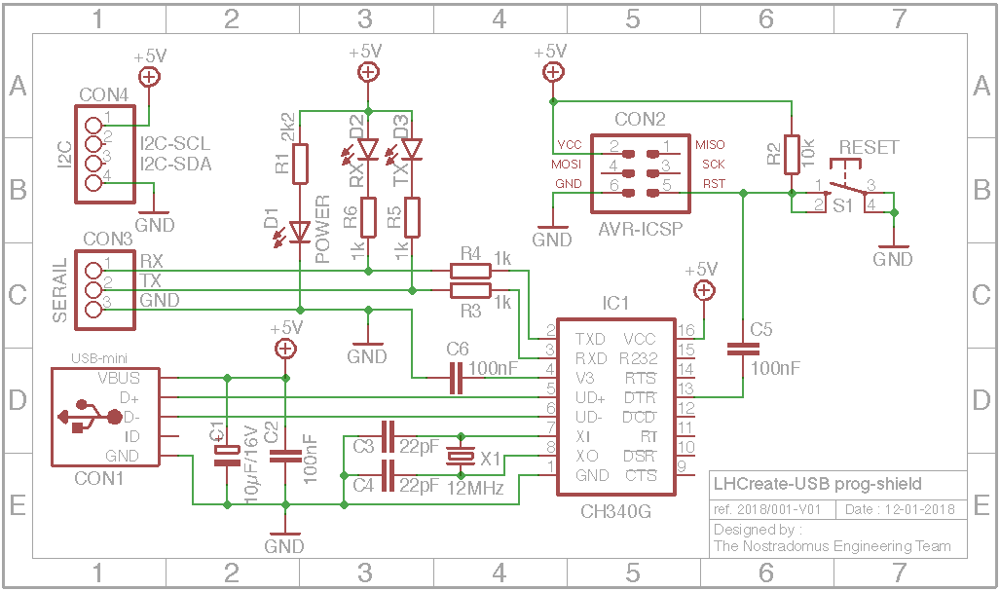
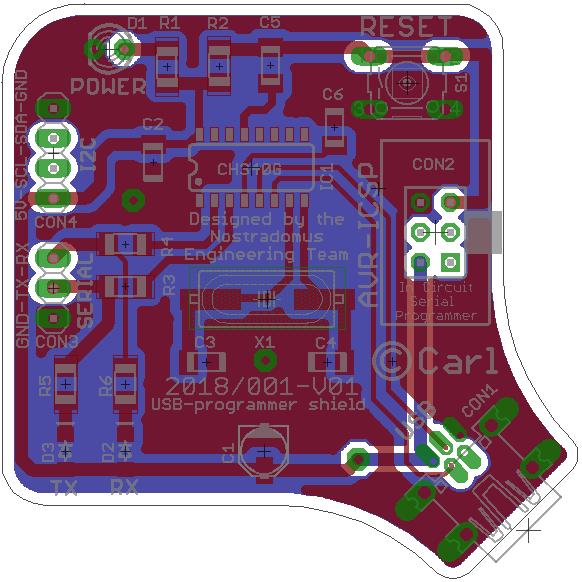

# USB programmer shield for the LHCreate eco-system

## What

## Why

## How

## Progress status

 - [x] have a [need](#what)
 - [x] decide on what is should [look](#how) like
 - [x] build [prototype electronics](#how)
 - [x] design a descent [electronics](#electronics) board
 - [ ] build the final [electronics](#electronics)
 - [ ] write [end-user documentation](https://github.com/nostradomus/LHCreate___usb-programmer-shield/wiki)

## Technical details

### Electronics

#### The Board

### Mechanical construction

The shield has been designed to fit on the LHCreate eco-system µ-controller board, by using its connectors for ICSP, I2C and serial communication.

### Building instructions

More coming soon.............

## Contributors

If you are having any good suggestions, just drop me a line [:email:](http://nostradomus.ddns.net/contactform.html).
If feasible, I'll be happy to implement proposed improvements.
And if you are having lots of time, I'll be happy to share the work with you ;-).

When you create your own version, don't forget to send us some nice pictures of your construction. We'll be happy to publish them in the :confetti_ball:Hall of Fame:confetti_ball:.

## :globe_with_meridians: License

At this moment, there is no specific license attached to this project yet.

So, today, if you like it, have fun with it (at your own risk of course :-D), and especially, be creative.

Oh, and when using anything from this repository, it is highly appreciated if you mention its origin.

If you would like to use any of this work (or the whole project) for commercial use, first [contact us :email:](http://nostradomus.ddns.net/contactform.html), so we can add the appropriate license, which best fits your business.
