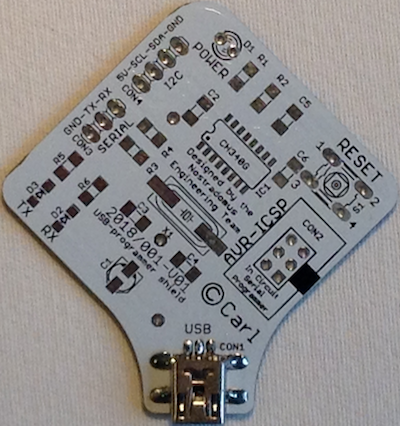
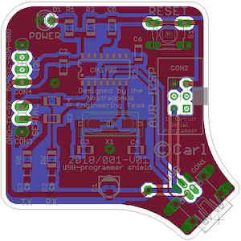
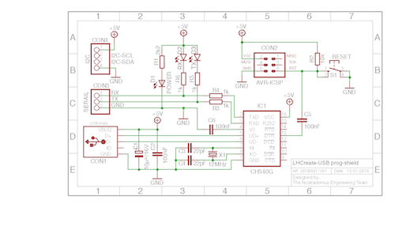

# 

## USB programmer shield for the LHCreate eco-system

### What

This board has been designed as a specific USB programmer shield for the [LHCreate eco-system](https://github.com/nostradomus/LHCreate-2017).

### Why

The concerning µ-controller board was fit with an ICSP-connector for programming through various programming devices. When using a µ-controller with proper bootloader, the system can also be programmed serially, by using below described shield. The USB programmer shield acts as a [USB-to-serial converter](pdf-files/datasheet-CH340G_USB_to_UART_Interface.pdf).

### How

The shield has been designed to mechanically fit on top of the µ-controller board by using the available connectors in the central square. These connectors contain all required electrical signals : RX, TX, reset, GND and +5V. The serial converter's DTR-line takes care of the reset signal to launch the bootloader. The shield transparently feeds through the signals from the I2C and ICSP connectors on the µ-controller board. They can be used as if the shield was not there (except during the uploading of new firmware of course).

### Progress status

 - [x] have a [need](#what)
 - [x] decide on what is should [look](#how) like
 - [x] build [prototype electronics](#how)
 - [x] design a descent [electronics](#electronics) board
 - [ ] build the final [electronics](#electronics)
 - [ ] write [end-user documentation](https://github.com/nostradomus/LHCreate___usb-programmer-shield/wiki)

### Technical details

#### Electronics

The CH340G USB-to-UART chip is the central component for this board. Crystal X1, together with load capacitors C3 and C4 will provide a stable clock to the chip. C1 and C2 stabilise the 5V power supply, which will either come from the USB connection, or from the underlying eco-system's µ-controller-board. R1, D1 will light up when the board is powered. C6 has been added for the 3V3 power-line coming from the CH340G chip (not used in this configuration). Through C5, the USB-to-UART chip will sent a reset signal to the µ-controller to be programmed, by means of its DTR line. Reset button S1 has been repeated on the programmer board for accessibility reasons. Pull-up resistor R2 is optional, and only needs to be mounted when the programmer-board is used as stand-alone to program minimal circuits (which have not been fit with such a resistor). R6/D2 and R5/D3 will blink when communication is on-going over the serial connections (RX and TX). R3 and R4 protect the serial connection on CON3 against over-current. I2C connection CON4 can be used transparently when the programming shield is fit on top of the µ-controller board. ICSP header CON2 can be used when the µ-controller is running (not during serial programming). The same applies for the serial connections on CON3.

#### Schematics & Board

 

#### Components list

Part           | Value       | Package          | Description  
-------------- | ----------- | ---------------- | -----------  
R1             | 2k2         | 1206             | resistor
R2             | 10kΩ        | 1206             | resistor
R3, R4, R5, R6 | 1kΩ         | 1206             | resistor
C1             | 10µF/16V    | Panasonic type B | polarized capacitor
C2, C5, C6     | 100nF       | 1206             | capacitor
C3, C4         | 22pF        | 1206             | capacitor
D1             | green-3mm   | 3mm              | LED
D2             | red         | 1206             | LED
D3             | yellow      | 1206             | LED
IC1            | CH340G      | SSOP-16          | USB to serial interface chip
S1             | momentary   | 6x6x6mm          | momentary tact push button
X1             | 12MHz       | SM49             | crystal
CON1           | mini-USB    | mini-USB         | mini-USB connector
CON2           | 2x3 (boxed) | 2x3              | AVR ISP-6 serial prog. header (long-needle F-M)
CON3           | 3-pin       | SIL03            | pin header (long-needle F-M)
CON4           | 4-pin       | SIL04            | pin header (long-needle F-M)

#### Mechanical construction

The shield has been designed to fit on the LHCreate eco-system µ-controller board, by using its connectors for ICSP, I2C and serial communication. For that matter, long-needle connectors need to be used. These connectors are of female type on the solder-side of the pcb, and have long pins pointing upwards on the component-side. This way all connections remain available during programming and debugging.

#### Building instructions

More coming soon.............

### Contributors

If you are having any good suggestions, just drop me a line [:email:](http://nostradomus.ddns.net/contactform.html).
If feasible, I'll be happy to implement proposed improvements.
And if you are having lots of time, I'll be happy to share the work with you ;-).

When you create your own version, don't forget to send us some nice pictures of your construction. We'll be happy to publish them in the :confetti_ball:Hall of Fame:confetti_ball:.

### :globe_with_meridians: License

At this moment, there is no specific license attached to this project yet.

So, today, if you like it, have fun with it (at your own risk of course :-D), and especially, be creative.

Oh, and when using anything from this repository, it is highly appreciated if you mention its origin.

If you would like to use any of this work (or the whole project) for commercial use, first [contact us :email:](http://nostradomus.ddns.net/contactform.html), so we can add the appropriate license, which best fits your business.
